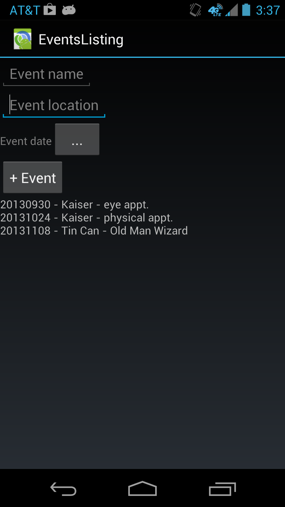
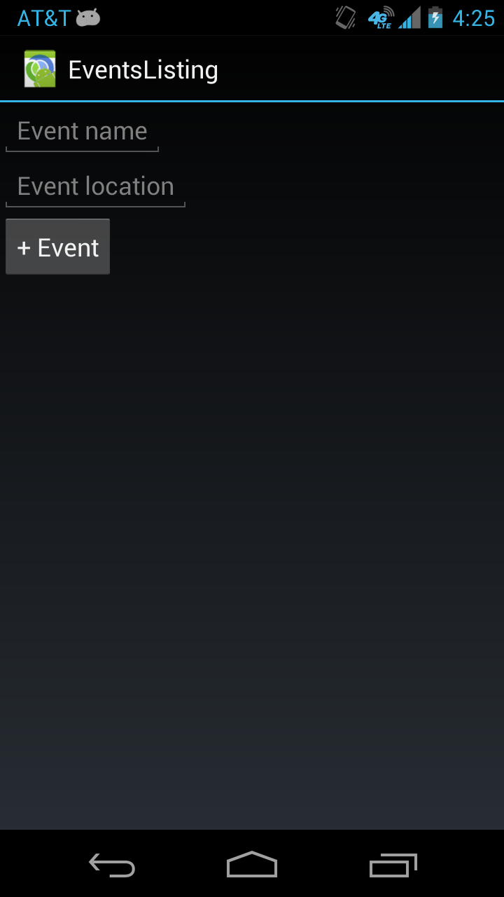
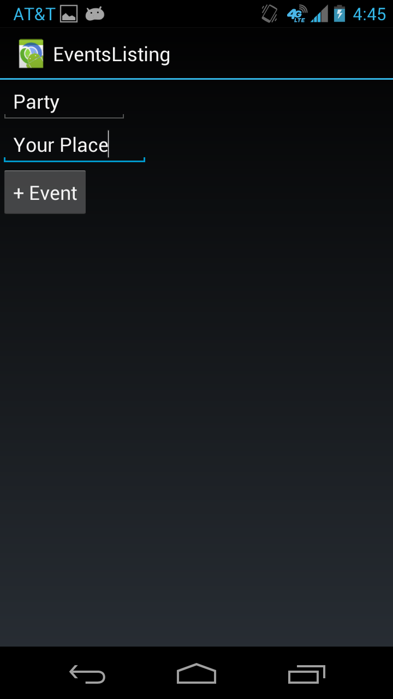
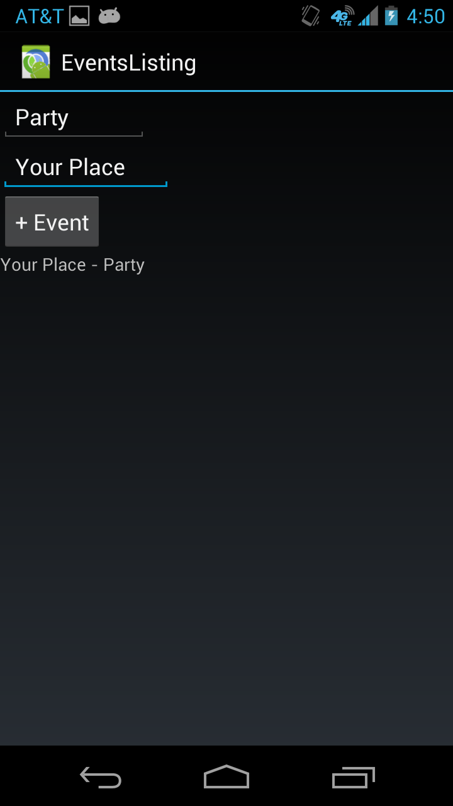
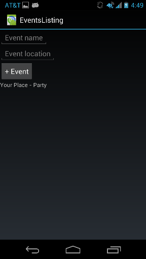
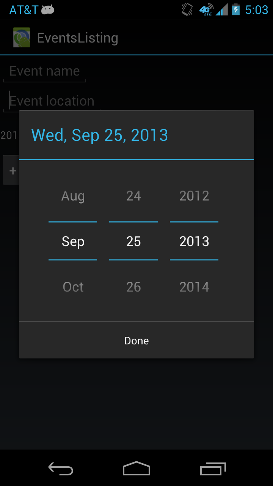

#Android App Development with Clojure:<br>An Interactive Tutorial 
by [Kris Calabio](https://github.com/krisc) ([@zangderak](https://twitter.com/zangderak))

###Is there a better way?

I've been programming in Java since I was an undergrad in college in 2006. While working a contract job in 2011-2012 in which I was hired to work with a huge mess of Java code[<sup>1</sup>](#1), I was left wondering if Java was rotting my brain. Surely, there has got to be a better way. After an impractical detour[<sup>2</sup>](#2), I decided to take on learning [Clojure](http://clojure.org/), a Lisp dialect for the JVM. After a two-year journey of hacking personal projects, Clojure is now my general programming language of choice.

While learning how to write apps for [Android](http://developer.android.com/), I was back to programming in Java and again was left thinking that there has got to be a better way! I looked into developing Android apps using Clojure. Although there
is still much room for maturation, the efforts of [Daniel Solano Gómez](http://www.youtube.com/watch?v=1NptqU3bqZE), [Alex Yakushev](http://clojure-android.blogspot.com/2013/06/state-of-clojure-on-android-2013.html), and [Zach Oakes](https://nightweb.net/blog/clojure-on-android.html) show a promising future for Clojure in Android development.

### Prerequisites

This tutorial is directed towards Clojure programmers who are seeking an alternative to the Java language for Android development. I will assume that you already know the basics of Clojure[<sup>3</sup>](#3) and Android.

We will be using Alex Yakushev's [lein-droid](https://github.com/clojure-android/lein-droid) tool for project management. We will also be using Alex's fork of Daniel Solano Gómez's [neko library](https://github.com/alexander-yakushev/neko/wiki) which provides function wrappers and alternatives to the Android Java API. However, neko does not replace everything as of the time of this writing and is subject to change so keep the [Android docs](http://developer.android.com/reference/packages.html) handy. There will be some Java interop in this tutorial. We will be using [emacs](http://www.gnu.org/software/emacs/) with the [nrepl] (https://github.com/clojure/tools.nrepl) plugin for this tutorial.

**Be forewarned:** some tools in this setup are still very young and are in fast development. New versions may pop up as of the time of this writing (Sep 25, 2013) and may introduce breaking changes. For your information, here are the versions of the tools that I am using:

```
Linux Mint 14 (Nadia)
Java 1.6.0_45
clojure-android/clojure 1.5.1-SNAPSHOT
Leiningen 2.3.1
lein-droid 0.2.0-beta3
Android SDK Tools 22.0.5
nrepl 0.2.0-bigstack
neko 3.0.0-preview1
clojure-complete 0.3.0-SNAPSHOT
```

Now that you have been **forewarned**, let's begin. If you run into problems, please [open an issue on GitHub](https://github.com/krisc/events/issues), and I'll try my best to help you out.

### What are we making?

Let's make a simple event listing app. This will not be a full-fledged calendar app, but rather a simple tool to pencil in events and have them sorted in chronological order. I have a text file on my desktop that I use to pencil in dates for gigs, practices, and other events.


Our app will be based off of this simple idea.



### Using lein-droid to setup our project

Alex's [Tutorial](https://github.com/clojure-android/lein-droid/wiki/Tutorial) is a good introduction to `lein-droid`. Skim through the tutorial to familiarize yourself with the basic `lein-droid` commands.

This is how my `~/.lein/profiles.clj` looks like:
```clojure
{:user {:plugins [ [lein-droid "0.2.0-beta3"] ]
        :android {:sdk-path "/home/kris/adt-bundle-linux-x86_64-20130522/sdk/"}}}
```

NOTE: Change the directory to reflect your own sdk's path. And if
there is a later version of `lein-droid`, consider using that.

Run this command at the terminal:

```bash
lein droid new events org.stuff.events :activity MyActivity :target-sdk 15 :app-name EventsListing
```

This will create a template file structure for an Android app. Open
the `project.clj` file and change the `neko` version in `:dependencies` to
`"3.0.0-preview1"`.

If you have an actual Android device at hand, connect it to your
computer. If not, you can setup an [emulator](http://developer.android.com/tools/devices/emulator.html). Now run `lein droid doall` at the terminal. This will build the app, install the app to your device, and open an `nREPL` server within the running app.

### Define the Layout

Let's open the main Clojure source file located at `./src/clojure/org/stuff/events/main.clj` in `emacs` and start defining the layout and the application. Now run this in `emacs`: `M-x nrepl` and enter the local machine for 'Host' and '9999' for 'Port'. Now you have a REPL in `emacs` which is connected to your running app. As you will see in a bit, this is neat-o torpedo.

To enter the namespace, type this command into the REPL: `(in-ns 'org.stuff.events.main)` To start evaluating definitions within our app's namespace, evaluate the `ns` form in the source file by entering the `emacs` command `C-c C-n` (or by moving the cursor after the closing parenthesis of the `ns` form and hitting `C-x C-e`).

Let's now code a definition for the layout of the app. The `make-ui` macro takes in a vector of elements which will be transformed into XML ([learn more here](https://github.com/alexander-yakushev/neko/wiki/User-interface)). This structure can be anonymously passed into `make-ui`, but let's give it a named definition:

```clojure
(def main-layout [:linear-layout {:orientation :vertical}
                  [:edit-text {:hint "Event name"}]
                  [:edit-text {:hint "Event location"}]])
```

Evaluate this `def` form. Let's change the `defactivity` form to look like this:

```clojure
(defactivity org.stuff.events.MyActivity
  :def a
  :on-create
  (fn [this bundle]
    (on-ui
     (set-content-view! a
      (make-ui main-layout)))))
```

### Interactive Development

To demonstrate the power of REPL driven development, move your cursor after the closing parenthesis of the `on-ui` form (after the third-to-last `)` from the end), then hit `C-x C-e`.


After you have finished geeking out on how cool what just happened was, let's add a button to the layout. Our `def` form for `main-layout` should now look like this:

```clojure
(def main-layout [:linear-layout {:orientation :vertical}
                  [:edit-text {:hint "Event name"}]
                  [:edit-text {:hint "Event location"}]
                  [:button {:text "+ Event"}]])
```

Evaluate this form. Then evaluate the `on-ui` form to update the app. (From now on, you can assume that newly added code should be evaluated.)



### Adding Functionality

The app doesn't really do anything right now. Let's add attributes to our layout elements for functionality.

```clojure
(declare ^android.widget.LinearLayout mylayout)

(def main-layout [:linear-layout {:orientation :vertical,
     		 		  :id-holder true
                                  :def `mylayout}
                  [:edit-text {:hint "Event name",
                               :id ::name}]
                  [:edit-text {:hint "Event location",
                               :id ::location}]
                  [:button {:text "+ Event"}]])
```

In order to access the layout by name, we added a `:def` attribute to our `main-layout`, an `:id-holder` flag, and a forward declaration form near the top of the source file. Additionally, our `edit-text` elements have `:id` attributes with a keyword value. The `declare` form allows us later to compile this code using AOT (more on using `lein` to build later).

With these additions, we can now access the values of these elements using `.getTag`. Enter some text into the edit-text fields in the running app:



Then try these at the REPL:

```clojure
org.stuff.events.main> (.getTag mylayout)
{:org.stuff.events.main/location #<EditText android.widget.EditText@42315c30>, :org.stuff.events.main/name #<EditText android.widget.EditText@42206a18>}
org.stuff.events.main> (str (.getText (::name (.getTag mylayout))))
"Party"
org.stuff.events.main> (str (.getText (::location (.getTag mylayout))))
"Your Place"
```

Note that the return value for the widget objects will probably be different for you. Now let's write a helper function for our convenience:

```clojure
(defn get-elmt [elmt]
  (str (.getText (elmt (.getTag mylayout)))))
```

Now let's have that button do some work.

```clojure
(declare android.widget.LinearLayout mylayout)
(declare add-event)

(def main-layout [:linear-layout {:orientation :vertical,
                                  :id-holder true,
                                  :def `mylayout}
                  [:edit-text {:hint "Event name",
                               :id ::name}]
                  [:edit-text {:hint "Event location",
                               :id ::location}]
                  [:button {:text "+ Event",
                            :on-click (fn [_] (add-event))}]])
```

We added an `:on-click` attribute to our `:button` element whose value is a callback function. Note the forward declaration for that callback function.

Well, we know that we need to add an event to the listing. First, let's add a new element to the layout that will contain the listing. We will use an atom[<sup>4</sup>](#4) to hold the current state of the listing.

```clojure
(defn mt-listing [] (atom ""))
(def listing (mt-listing))

(def main-layout [:linear-layout {:orientation :vertical,
                                  :id-holder true,
                                  :def `mylayout}
                  [:edit-text {:hint "Event name",
                               :id ::name}]
                  [:edit-text {:hint "Event location",
                               :id ::location}]
                  [:button {:text "+ Event",
                            :on-click (fn [_] (add-event))}]
                  [:text-view {:text @listing,
                              :id ::listing}]])
```

Here, we have a constructor which returns a new atom (an empty string). This enables us to have multiple listing objects to work with if we want to. In this tutorial, we will have one listing defined by
`(def listing (mt-listing))`. The value of the listing atom is used for the :text attribute of the newly added :text-view element.

Before we define the callback function, let's play with the REPL and figure out what we actually want to do when the user hits that button. First, we want to update the listing atom with the contents of the `:edit-text` fields. Enter an event in the running app then run this in the REPL:

```clojure
org.stuff.events.main> (swap! listing str (get-elmt ::location) " - " 
		       (get-elmt ::name) "\n")
"Your Place - Party\n"
```

Next, we want to update the ui with the listing. We can use the `config` macrio in `neko.ui` to achieve this. Let's update the `ns` form at the top of the source:

```clojure
...
[neko.ui :only [make-ui config]]
...
```

Run `C-c C-n` to evaluate the `ns` form then enter this into the REPL:


```clojure
org.stuff.events.main> (on-ui (config (::listing (.getTag mylayout)) :text @listing))
```

Let's write another helper function for setting the text of our elements.

```clojure
(defn set-elmt [elmt s]
  (on-ui (config (elmt (.getTag mylayout)) :text s)))
```

Let's have our callback function perform these two tasks:

```clojure
(defn add-event []
  (swap! listing str (get-elmt ::location) " - " 
		   (get-elmt ::name) "\n")
  (set-elmt ::listing @listing))
```

Now try hitting that button. Cool, huh?



If you need to clear your listing, just run `(def listing (mt-listing))`.

Hitting the button should also clear the edit fields. Let's write a function to take care of all that.

```clojure
(defn update-ui []
  (set-elmt ::listing @listing)
  (set-elmt ::location "")
  (set-elmt ::name ""))

```

And let's have our `add-event` function call this.

```clojure
(defn add-event []
  (swap! listing str (get-elmt ::location) " - " 
		   (get-elmt ::name) "\n")
  (update-ui))
```

If you're coding along at home (and I hope you are!), here is what our code should look like so far:

```clojure
(ns org.stuff.events.main
  (:use [neko.activity :only [defactivity set-content-view!]]
        [neko.threading :only [on-ui]]
        [neko.ui :only [make-ui]]
        [neko.application :only [defapplication]]))

(declare android.widget.LinearLayout mylayout)
(declare add-event)

(defn mt-listing [] (atom ""))
(def listing (mt-listing))

(def main-layout [:linear-layout {:orientation :vertical,
                                  :id-holder true,
                                  :def `mylayout}
                  [:edit-text {:hint "Event name",
                               :id ::name}]
                  [:edit-text {:hint "Event location",
                               :id ::location}]
                  [:button {:text "+ Event",
                            :on-click (fn [_](add-event))}]
                  [:text-view {:text @listing,
                              :id ::listing}]])

(defn get-elmt [elmt]
  (str (.getText (elmt (.getTag mylayout)))))

(defn set-elmt [elmt s]
  (on-ui (.setText (elmt (.getTag mylayout)) s)))

(defn update-ui []
  (set-elmt ::listing @listing)
  (set-elmt ::location "")
  (set-elmt ::name ""))

(defn add-event []
  (swap! listing str (get-elmt ::location) " - " 
		   (get-elmt ::name) "\n")
  (update-ui))

(defactivity org.stuff.events.MyActivity
  :def a
  :on-create
  (fn [this bundle]
    (on-ui
     (set-content-view! a
      (make-ui main-layout)))))
```

So far so good... So what? It might be a good idea to build your app right now by running at the terminal `lein droid doall`. Note that you may have to connect your REPL again after you run this command.

### Just One Little Fix


If you rotated your screen, you may have noticed that the listing disappears. Let's fix that, shall we?

```clojure
(defactivity org.stuff.events.MyActivity
  :def a
  :on-create
  (fn [this bundle]
    (on-ui
     (set-content-view! a
      (make-ui main-layout)))
    (on-ui
     (set-elmt ::listing @listing))))
```

Rotate your screen.



Now that's what I'm talking about. The REPL never ceases to amaze me.

### The Date Picker
What's the point of an event listing without sorted dates? Let's use java interop to make a date picker[<sup>5</sup>](#5).



First, let's add some imports into our `ns` form:

```clojure
(ns org.stuff.events.main
  (:use [neko.activity :only [defactivity set-content-view!]]
        [neko.threading :only [on-ui]]
        [neko.ui :only [make-ui]]
        [neko.application :only [defapplication]])
  (:import (java.util Calendar)
           (android.app Activity)
           (android.app DatePickerDialog DatePickerDialog$OnDateSetListener)
           (android.app DialogFragment)))
```

Before we continue, let's change the `defactivity` form a bit so we can access our activity outside of this form.

```clojure
(defactivity org.stuff.events.MyActivity
  :on-create
  (fn [this bundle]
    (on-ui
     (set-content-view! myActivity
      (make-ui main-layout)))
    (on-ui
     (set-elmt ::listing @listing))))
```

Note that when the `:def` attribute is removed, we can refer to our `MyActivity` by `myActivity`. This is how we will refer to our activity in the upcoming function. Also note that re-evaluating this form may not be enough since the `:on-create` callback needs to be called. Rotating your screen will do!

Now we will use `proxy` to create an instance of an anonymous class:

```clojure
(defn date-picker []
  (proxy [DialogFragment DatePickerDialog$OnDateSetListener] []
    (onCreateDialog [savedInstanceState]
      (let [c (Calendar/getInstance)
            year (.get c Calendar/YEAR)
            month (.get c Calendar/MONTH)
            day (.get c Calendar/DAY_OF_MONTH)]
        (DatePickerDialog. myActivity this year month day)))
     (onDateSet [view year month day])))
```

Calling this function creates an instance of a `date-picker` object. Let's add a new button to the layout that will create then show this dialog.

```clojure
(declare date-picker)
(declare show-picker)

(def main-layout [:linear-layout {:orientation :vertical,
                                  :id-holder true,
                                  :def `mylayout}
                  [:edit-text {:hint "Event name",
                               :id ::name}]
                  [:edit-text {:hint "Event location",
                               :id ::location}]
                  [:button {:text "...",
                            :on-click (fn [_] (show-picker (date-picker)))}]
                  [:button {:text "+ Event",
                            :on-click (fn [_](add-event))}]
                  [:text-view {:text @listing,
                              :id ::listing}]])

(defn show-picker [dp]
  (. dp show (. myActivity getFragmentManager) "datePicker"))
```

Update your `ui` and try hitting that `...` button. Now let's have that dialog update a `:text-view` with that chosen date.

```clojure
(def main-layout [:linear-layout {:orientation :vertical,
                                  :id-holder :true,
                                  :def `mylayout}
                  [:edit-text {:hint "Event name",
                               :id ::name}]
                  [:edit-text {:hint "Event location",
                               :id ::location}]
                  [:linear-layout {:orientation :horizontal}
                   [:text-view {:hint "Event date",
                                :id ::date}]
                   [:button {:text "...",
                             :on-click (fn [_] (show-picker (date-picker)))}]]
                  [:button {:text "+ Event",
                            :on-click (fn [_](add-event))}]
                  [:text-view {:text @listing,
                              :id ::listing}]])
```

Note that the new `:text-view` element and the button that spawns the picker are inside a nested `:linear-layout` element. Our date string will have the YYYYMMDD format. Now let's fill out that listener function in our proxy object.

```clojure
(defn date-picker []
  (proxy [DialogFragment DatePickerDialog$OnDateSetListener] []
    (onCreateDialog [savedInstanceState]
      (let [c (Calendar/getInstance)
            year (.get c Calendar/YEAR)
            month (.get c Calendar/MONTH)
            day (.get c Calendar/DAY_OF_MONTH)]
        (DatePickerDialog. myActivity this year month day)))
     (onDateSet [view year month day]
       (on-ui (.setText (::date (.getTag mylayout))
                        (str year
                             (format "%02d" (inc month))
                             (format "%02d" day)))))))
```

Now try the `date-picker` again. Let's change `add-event` to include the date.

```clojure
(defn add-event []
  (swap! listing str (get-elmt ::date) " - "
         (get-elmt ::location) " - " 
         (get-elmt ::name) "\n")
  (update-ui))
```

Here's what our source file looks like so far:

```clojure
(ns org.stuff.events.main
  (:use [neko.activity :only [defactivity set-content-view!]]
        [neko.threading :only [on-ui]]
        [neko.ui :only [make-ui]]
        [neko.application :only [defapplication]])
  (:import (java.util Calendar)
           (android.view View)
           (android.app Activity)
           (android.app DatePickerDialog DatePickerDialog$OnDateSetListener)
           (android.app DialogFragment)))

(declare android.widget.LinearLayout mylayout)
(declare add-event)
(declare date-picker)
(declare show-picker)

(defn mt-listing [] (atom ""))
(def listing (mt-listing))

(def main-layout [:linear-layout {:orientation :vertical,
                                  :id-holder true,
                                  :def `mylayout}
                  [:edit-text {:hint "Event name",
                               :id ::name}]
                  [:edit-text {:hint "Event location",
                               :id ::location}]
                  [:linear-layout {:orientation :horizontal}
                   [:text-view {:hint "Event date",
                                :id ::date}]
                   [:button {:text "...",
                             :on-click (fn [_] (show-picker (date-picker)))}]]
                  [:button {:text "+ Event",
                            :on-click (fn [_](add-event))}]
                  [:text-view {:text @listing,
                              :id ::listing}]])

(defn get-elmt [elmt]
  (str (.getText (elmt (.getTag mylayout)))))

(defn set-elmt [elmt s]
  (on-ui (.setText (elmt (.getTag mylayout)) s)))

(defn update-ui []
  (set-elmt ::listing @listing)
  (set-elmt ::location "")
  (set-elmt ::name ""))

(defn add-event []
  (swap! listing str
  	 (get-elmt ::date) " - "
  	 (get-elmt ::location) " - " 
 	 (get-elmt ::name) "\n")
  (update-ui))

(defactivity org.stuff.events.MyActivity
  :on-create
  (fn [this bundle]
    (on-ui
     (set-content-view! myActivity
      (make-ui main-layout)))
    (on-ui
     (set-elmt ::listing @listing))))

(defn date-picker []
  (proxy [DialogFragment DatePickerDialog$OnDateSetListener] []
    (onCreateDialog [savedInstanceState]
      (let [c (Calendar/getInstance)
            year (.get c Calendar/YEAR)
            month (.get c Calendar/MONTH)
            day (.get c Calendar/DAY_OF_MONTH)]
        (DatePickerDialog. myActivity this year month day)))
     (onDateSet [view year month day]
       (on-ui (.setText (::date (.getTag mylayout))
                        (str year
                             (format "%02d" (inc month))
                             (format "%02d" day)))))))

(defn show-picker [dp]
  (. dp show (. myActivity getFragmentManager) "datePicker"))
```

###Sorting and Formatting the Listing
Now that we have dates, we can sort our listing. Let's change our `mt-listing` constructor to return a `sorted-map` `atom`.

```clojure
(defn mt-listing [] (atom (sorted-map)))
```

We will now make a huge change to the `add-event` function. Are you ready? Let's leave formatting out of this and only deal with updating our data structure. The keys to our map will be an integer representing the date. Each date should be able to hold multiple events, so the value of the key will be a vector of location and name vectors. 

```clojure
(defn add-event []
  (let [date-key (try
                   (read-string (get-elmt ::date))
                   (catch RuntimeException e "Date string is empty!"))]
    (when (number? date-key)
      (if (some #{date-key} (keys @listing))
        ; add to existing date
        (swap! listing assoc date-key
               (conj (@listing date-key)
                     [(get-elmt ::location) (get-elmt ::name)]))
        ; add new date
        (swap! listing assoc date-key
               [[(get-elmt ::location) (get-elmt ::name)]]))
      (update-ui))))
```

Since our listing `atom` no longer references a string, we need to format our map. Since our data structure contains a vector of vectors, we will implement this using nested loops. To prevent this code from
looking like a monstrosity, let's split it into two functions: one to loop over the dates and another to loop over the events within each date. Here we go.

```clojure
(defn format-events [e]
  ; loop through events within dates
  (loop [events e ret "" loop0 true]
    (if-not events          
      ret
      (let [loc (first (first events))
            name (second (first events))]
        (recur (next events)
               (if loop0
                 (str ret loc " - " name "\n")
                 ;NOTE: hard coding whitespace below
                 (str ret "                      " loc " - " name "\n"))
               false)))))

(defn format-listing [lst]
  ; loop through dates
  (loop [keyval (seq lst) ret ""]
    (if-not keyval
      ret
      (let [date (first (first keyval))]
        (recur (next keyval) 
               (str ret date " - " 
                    ; loop through events within dates
                    (format-events (second (first keyval)))))))))
```

Let's replace all occurrences in our code that assumes `@listing` to be a string with `(format-listing @listing)`. In our layout:

```clojure
(def main-layout [:linear-layout {:orientation :vertical,
                                  :id-holder :true,
                                  :def `mylayout}
                  [:edit-text {:hint "Event name",
                               :id ::name}]
                  [:edit-text {:hint "Event location",
                               :id ::location}]
                  [:linear-layout {:orientation :horizontal}
                   [:text-view {:hint "Event date",
                                :id ::date}]
                   [:button {:text "...",
                             :on-click (fn [_] (show-picker (date-picker)))}]]
                  [:button {:text "+ Event",
                            :on-click (fn [_](add-event))}]
                  [:text-view {:text (format-listing @listing),
                              :id ::listing}]])
```

And in `update-ui`:

```clojure
(defn update-ui []
  (set-elmt ::listing (format-listing @listing))
  (set-elmt ::location "")
  (set-elmt ::name "")
  (set-elmt ::date ""))
```

###Succinctness is Power

Here is the source code so far:

```clojure
(ns org.stuff.events.main
  (:use [neko.activity :only [defactivity set-content-view!]]
        [neko.threading :only [on-ui]]
        [neko.ui :only [make-ui]]
        [neko.application :only [defapplication]])
  (:import (java.util Calendar)
           (android.app Activity)
           (android.app DatePickerDialog DatePickerDialog$OnDateSetListener)
           (android.app DialogFragment)))

(declare android.widget.LinearLayout mylayout)
(declare add-event)
(declare date-picker)
(declare show-picker)

(defn mt-listing [] (atom (sorted-map)))
(def listing (mt-listing))

(defn format-events [e]
  ; loop through events within dates
  (loop [events e ret "" loop0 true]
    (if-not events          
      ret
      (let [loc (first (first events))
            name (second (first events))]
        (recur (next events)
               (if loop0
                 (str ret loc " - " name "\n")
                 ;NOTE: hard coding whitespace below
                 (str ret "                      " loc " - " name "\n"))
               false)))))

(defn format-listing [lst]
  ; loop through dates
  (loop [keyval (seq lst) ret ""]
    (if-not keyval
      ret
      (let [date (first (first keyval))]
        (recur (next keyval) 
               (str ret date " - " 
                    ; loop through events within dates
                    (format-events (second (first keyval)))))))))

(def main-layout [:linear-layout {:orientation :vertical,
                                  :id-holder true,
                                  :def `mylayout}
                  [:edit-text {:hint "Event name",
                               :id ::name}]
                  [:edit-text {:hint "Event location",
                               :id ::location}]
                  [:linear-layout {:orientation :horizontal}
                   [:text-view {:hint "Event date",
                                :id ::date}]
                   [:button {:text "...",
                             :on-click (fn [_] (show-picker (date-picker)))}]]
                  [:button {:text "+ Event",
                            :on-click (fn [_](add-event))}]
                  [:text-view {:text (format-listing @listing),
                              :id ::listing}]])

(defn get-elmt [elmt]
  (str (.getText (elmt (.getTag mylayout)))))

(defn set-elmt [elmt s]
  (on-ui (.setText (elmt (.getTag mylayout)) s)))

(defn update-ui []
  (set-elmt ::listing (format-listing @listing))
  (set-elmt ::location "")
  (set-elmt ::name "")
  (set-elmt ::date ""))

(defn add-event []
  (let [date-key (try
                   (read-string (get-elmt ::date))
                   (catch RuntimeException e "Date string is empty!"))]
    (when (number? date-key)
      (if (some #{date-key} (keys @listing))
        ; add to existing date
        (swap! listing assoc date-key
               (conj (@listing date-key)
                     [(get-elmt ::location) (get-elmt ::name)]))
        ; add new date
        (swap! listing assoc date-key
               [[(get-elmt ::location) (get-elmt ::name)]]))
      (update-ui))))

(defactivity org.stuff.events.MyActivity
  :on-create
  (fn [this bundle]
    (on-ui
     (set-content-view! myActivity
      (make-ui main-layout)))
    (on-ui
     (set-elmt ::listing (format-listing @listing)))))

(defn date-picker []
  (proxy [DialogFragment DatePickerDialog$OnDateSetListener] []
    (onCreateDialog [savedInstanceState]
      (let [c (Calendar/getInstance)
            year (.get c Calendar/YEAR)
            month (.get c Calendar/MONTH)
            day (.get c Calendar/DAY_OF_MONTH)]
        (DatePickerDialog. myActivity this year month day)))
     (onDateSet [view year month day]
       (on-ui (.setText (::date (.getTag mylayout))
                        (str year
                             (format "%02d" (inc month))
                             (format "%02d" day)))))))

(defn show-picker [dp]
  (. dp show (. myActivity getFragmentManager) "datePicker"))
```

This is a bit over 100 lines of code. When I first attempted to write this app using Java, I was well over 1000 lines and didn't even have all this functionality before I gave up. If succinctness really is power[<sup>6</sup>](#6), then I'm never looking back.

The source code and the entire project directory can be found on [my GitHub](https://github.com/krisc/events).

###Suggestions and Tips
Hopefully this is enough to get you started developing Android apps in Clojure. I leave polishing the app as an exercise for you, dear reader. To make this app actually useful, you might want to make the sorted map data structure persistent using some sort of [content provider](http://developer.android.com/guide/topics/providers/content-providers.html). It might also help to make the `:text-view` for the listing scrollable once you have a lot of events listed.

#####Debugging and logging

You will probably run into errors and even bugs with the tools. [adb](http://developer.android.com/tools/help/adb.html) will prove to be very valuable. In a spare terminal, run this command:

```bash
<sdk-path>/platform-tools/adb logcat
```

`neko` provides [logging](http://alexander-yakushev.github.io/neko/#neko.log) capabilities. Add this to the `:use` directive in the `ns` form:

```clojure
[neko.log :only [deflog]]
```

Add this line near the top of your source file:

```clojure
(deflog "MyTAG")
```

Now you can write lines to `adb logcat` by calling something like:

```clojure
(log-d "My log message")
```

#####I lost my REPL!
Given the instability of the current tools, runtime errors in the code, and other bugs, you will probably lose your connection to the REPL at some point during development. Follow these steps to get back into your groove. In the terminal:

```bash
lein do droid run, droid forward-port
```

And in `emacs`: `M-x nrepl`, local machine for 'Host', and '9999' for 'Port'. Now in the REPL, run:

```clojure
(in-ns 'org.stuff.events.main)
```
Then evaluate the `ns` form to get back into your running app's namespace. The important thing to know is that all the new code you wrote after your last `build` has to be evaluated at the REPL in order to get back to your previous state. Running `lein droid doall` at the terminal at key points of development can save you some steps whenever you lose your REPL connection.

###Conclusion
The tools available for Android development are still young. Needless to say, you will probably run into some issues and bugs along the way. If you are serious about pursuing this bleeding edge stuff, get connected with the maintainers of these tools. Alex Yakushev in particular has been very helpful and quick to respond to me personally as I was learning how to use [lein-droid](https://github.com/clojure-android/lein-droid/issues?state=open). Phil Hagelberg (a.k.a. [technomancy](https://github.com/technomancy)) of [lein](https://github.com/technomancy/leiningen) is also pretty responsive.

Problems? Please [open an issue on GitHub](https://github.com/krisc/events/issues), and I'll try my best to help you out. Other comments? Feel free to get in touch and [follow me on Twitter](https://twitter.com/zangderak).

###Notes
1.<a name="1"></a> In ["Code's Worst Enemy"](http://steve-yegge.blogspot.com/2007/12/codes-worst-enemy.html) Steve Yegge writes:
>Bigger is just something you have to live with in Java. Growth is a fact of life. Java is like a variant of the game of Tetris in which none of the pieces can fill gaps created by the other pieces, so all you can do is pile them up endlessly.


2.<a name="2"></a> In ["In Praise of Impractical Programming"](http://www.niemanlab.org/2011/11/in-praise-of-impractical-programming/) Jacob Harris writes:
>Learning to program is an important skill; learning how to be a programmer requires a far different type of course. For that, I have to thank a truly impractical introduction...

3.<a name="3"></a> If you don't yet know Clojure, I recommend [Joy of Clojure](http://joyofclojure.com/) and watching Rich Hickey's [talks](http://thechangelog.com/rich-hickeys-greatest-hits/). Despite it's power and simplicity, I wouldn't recommend Clojure to novice programmers. One should probably be fluent in at least two or three other languages before taking on Clojure. If you really want to dive into the rabbit hole, I recommend SICP (these [lectures](http://www.youtube.com/watch?v=2Op3QLzMgSY&list=PL8FE88AA54363BC46) were filmed in 1986 but still relevant) before jumping into Clojure. Learning the Clojure way is quite a journey and deserves it's own blog post.

4.<a name="4"></a> Use mutable state at your own judgment. Learn more about immutability, state, and identity [here](http://clojure.org/state).

5.<a name="5"></a> For reference, this code was translated from this [page](http://developer.android.com/guide/topics/ui/controls/pickers.html#DatePicker).

6.<a name="6"></a> In ["Succinctness is Power"](http://www.paulgraham.com/power.html) Paul Graham writes:
>If smaller source code is the purpose of high-level languages, and the power of something is how well it achieves its purpose, then the measure of the power of a programming language is how small it makes your programs.

